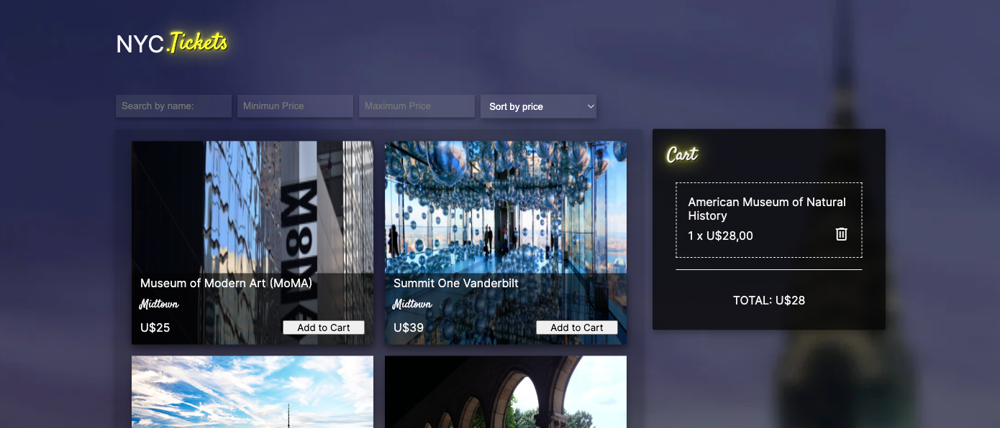
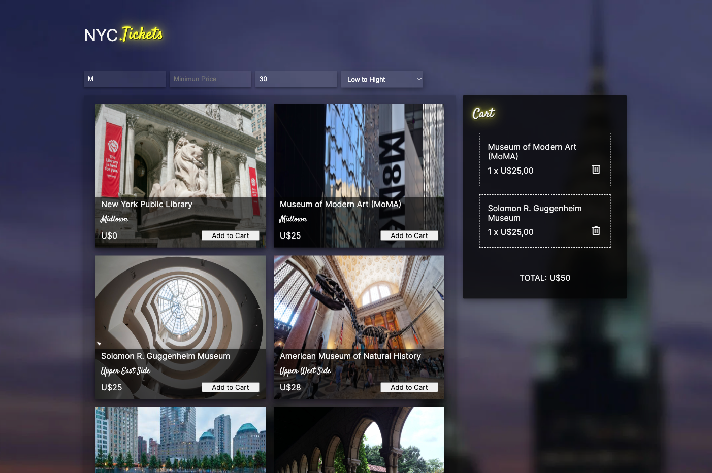
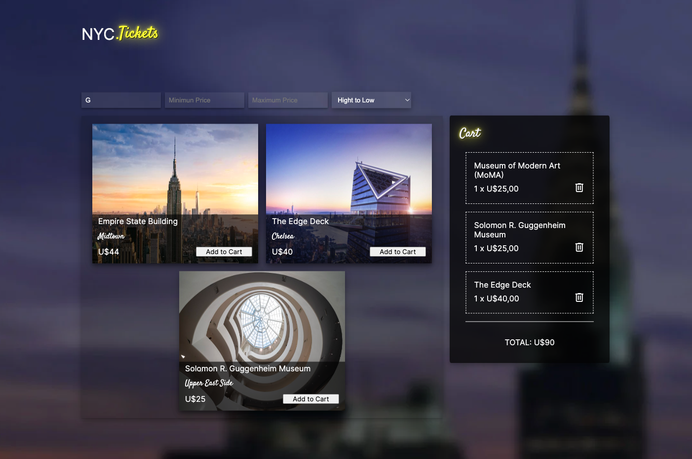

# NYC Tickets


O Projeto NYC TICKETS funciona como o front-end de um E-Commerce que possui uma página com três seções: Lista de ingressos, Filtros e o Carrinho.

## Índice

- <a href="#funcionalidades">Funcionalidades do Projeto</a>
- <a href="#layout">Layout</a>
- <a href="#demonstracao">Demonstraçāo</a>
- <a href="#rodar">Como rodar este projeto?</a>
- <a href="#tecnologias">Tecnologias Utilizadas</a>
- <a href="#autoras">Pessoa Autora</a>

## 📱 Funcionalidades do Projeto

1. [x] Lista de Ingressos
   - Mostrando todos os produtos
   - Ordenaçāo crescente ou decrescente de preço
   - Produtos:
        - Tem um botão que permita adicioná-los ao carrinho
        - Exibe o nome, preço e imagem em um card
2. [x] Filtros
    - Por valor mínimo e máximo
    - Por nome do produto
3. [x] Carrinho
    - Mostra todos os produtos e quantidades adicionadas
    - Pode-se remover itens do carrinho
    - Mostrar o valor total do carrinho
  

## 💻 Layout





## 💿 Demonstraçāo

[Link demonstraçāo](http://nyc-tickets.surge.sh/)

## 📝 Como rodar este projeto?

```bash
# Clone este repositório
$ git clone linkrepo

# Acesse a pasta do projeto no seu terminal
$ cd nyc-tickets-app

# Instale as dependências
$ npm install

# Execute a aplicaçāo
$ npm run start

# A aplicaçāo será iniciada na porta 3000, acesse pelo navegador: http://localhost:3000
```

## 📚 Tecnologias utilizadas

1. [JSX](https://pt-br.reactjs.org/docs/introducing-jsx.html)
2. [Componentes](https://pt-br.reactjs.org/docs/components-and-props.html)
3. [Props](https://pt-br.reactjs.org/docs/components-and-props.html)
4. [Estado](https://pt-br.reactjs.org/docs/state-and-lifecycle.html)
5. [FLuxo de Dados](https://pt-br.reactjs.org/docs/thinking-in-react.html)
6. [Renderização de listas](https://pt-br.reactjs.org/docs/lists-and-keys.html)
7. [Renderização condicional](https://pt-br.reactjs.org/docs/conditional-rendering.html)
8. [localStorage ](https://warcontent.com/localstorage-javascript/)

## 🙋‍♀️ Pessoa Autora

[Linkedin](https://www.linkedin.com/in/larissa-terada/)